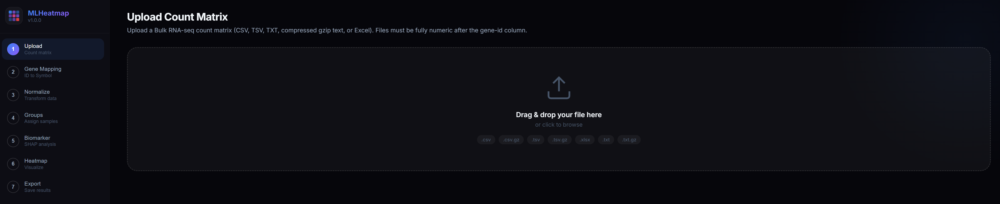
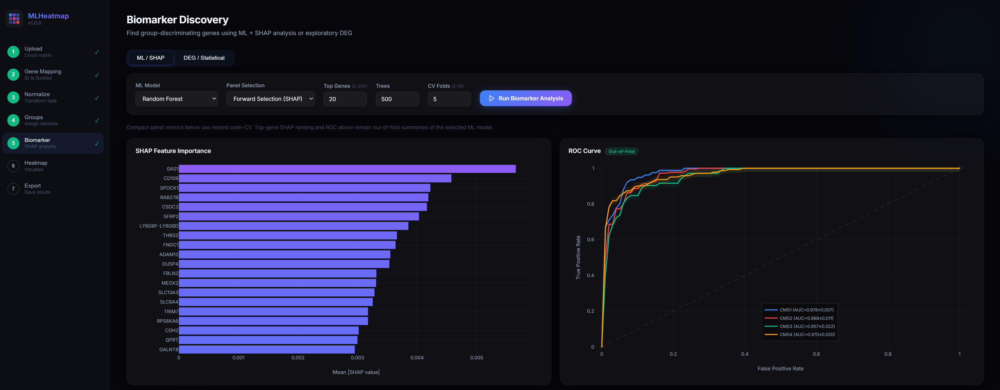
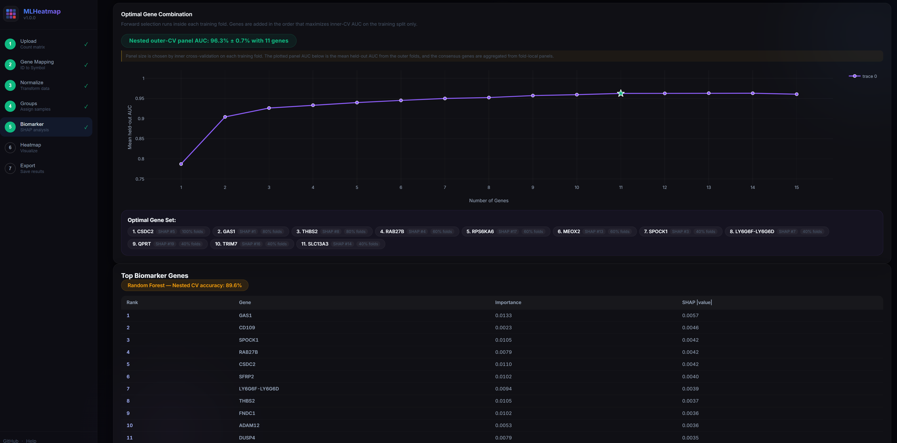
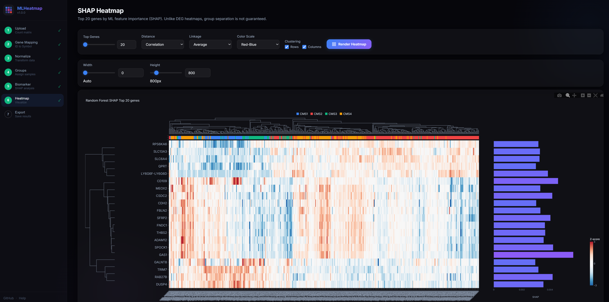
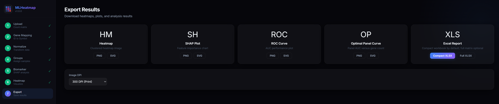

# MLHeatmap

Interactive RNA-seq heatmap and biomarker discovery tool for bulk count matrices.

## Screenshots

### 1. Upload



### 2. Classification Performance



### 3. Biomarker Analysis



### 4. SHAP Heatmap



### 5. Export



## Quickstart

### Get the repository

```bash
git clone https://github.com/kangk1204/MLHeatmap.git
cd MLHeatmap
```

### Native install

From a local clone of this repository:

```bash
pip install .
mlheatmap
```

The app starts on `http://127.0.0.1:8765`.

To enable the optional `xgboost` and `lightgbm` models in a native installation:

```bash
pip install ".[full]"
```

To run the test suite from a local clone:

```bash
pip install ".[test]"
pytest
```

### One-step installers

Windows:

```bat
install-windows.cmd
```

Ubuntu:

```bash
bash ./install-ubuntu.sh
```

macOS Apple Silicon:

```bash
bash ./install-macos.sh
```

Each installer:

- Reuses Python `3.11` or `3.12`, or bootstraps one when needed
- Creates or repairs a local `.venv`
- Installs MLHeatmap as a regular package
- Runs `mlheatmap --self-check`
- Starts the app locally

Validation note:

- On the validation machine used for this repository, system Python `3.11`/`3.12` was not available.
- Verification therefore used a user-scope Python `3.12` bootstrap path before creating the local `.venv`.
- The app and tests still completed successfully, but that validation path is not the same as reproducing the README with a preinstalled system Python.

After installation, restart with:

macOS Apple Silicon:

```bash
bash ./run-macos.sh
```

Ubuntu:

```bash
bash ./run-ubuntu.sh --no-browser
```

Windows:

```bat
run-windows.cmd --no-browser
```

Runtime notes:

- The local app server keeps running until you stop the process yourself. Session cleanup does not shut down the server.
- You cannot run two MLHeatmap instances on the same host and port at the same time. The second process will fail with an address-in-use error.
- To run multiple local instances, start the second one on a different port such as `mlheatmap --port 8766 --no-browser`.

### Docker

Docker is the recommended path when you need the optional `xgboost` and `lightgbm` models:

```bash
docker build -t mlheatmap .
docker run --rm -p 8765:8765 mlheatmap
```

### Example Sessions

If you want one file to test the app from upload to export, start with:

`test_data/human_ensembl_12samples.csv`

This is now the main bundled demo dataset. It is small enough to run quickly, but large enough to exercise gene mapping, normalization, binary grouping, biomarker analysis, DEG, heatmap rendering, and export.

What this file contains:

- 12 human samples
- 6 `Control_*` samples
- 6 `Treated_*` samples
- Ensembl-style human gene IDs in the first column
- Integer count values in every remaining cell

Suggested first run:

1. Start MLHeatmap with `mlheatmap`.
2. Upload `test_data/human_ensembl_12samples.csv`.
3. In `Gene Mapping`, choose `Human` and keep `Auto-detect`.
4. Normalize with `DESeq2-like VST`.
5. In `Groups`, click `Auto-detect` or assign `Control` and `Treated`.
6. Run `Biomarker` for a simple 2-group marker demo, or `DEG` for a quick differential-expression check.
7. Export a plot or workbook to confirm the full workflow.

Other bundled test files:

- `test_counts.csv`: the smallest parser smoke-test file
- `test_data/human_60k_8samples.csv`: a larger synthetic RNA-seq matrix for performance and UI checks

Practical note:

- These files are synthetic test data for demos, smoke tests, and UI validation. They are not biological reference datasets.

## Export Options

- Plot and heatmap images are exported in the browser.
- `Compact XLSX` is the default workbook export. It omits the full normalized expression matrix and is recommended for routine sharing and review.
- `Full XLSX` includes the `Normalized Expression` sheet and can be substantially larger for RNA-seq datasets.

## Input Rules

MLHeatmap expects a matrix with:

- Gene IDs in the first column
- Sample names in the header row
- Numeric count values in every remaining cell

Accepted formats:

- `.csv`
- `.tsv`
- `.txt`
- `.csv.gz`
- `.tsv.gz`
- `.txt.gz`
- `.xlsx`

Minimal CSV example:

```csv
gene_id,Control_1,Control_2,Treated_1,Treated_2
ENSG00000100000,213,78,1414,1071
ENSG00000100001,158,58,2569,2965
ENSG00000100002,157,106,526,1153
```

How to read this format:

- Each row is one gene
- The first column is the gene identifier
- Each remaining column is one sample
- The header row contains the sample names
- Every value after the first column must be numeric

Common valid first-column examples:

- Human Ensembl IDs such as `ENSG00000141510`
- Human gene symbols such as `TP53`
- Mouse Ensembl IDs such as `ENSMUSG00000059552`
- Mouse gene symbols such as `Trp53`

Sample naming tips:

- `Control_1`, `Control_2`, `Treated_1`, `Treated_2` works well for binary demos
- `CMS1__SampleA`, `CMS2__SampleB`, `CMS3__SampleC` works well when you want `Groups -> Auto-detect` to create labeled classes automatically

Fail-closed validation:

- Fully empty rows or columns are dropped
- Any remaining missing value, text value, mixed-type cell, `NaN`, or `inf` causes upload failure
- The upload API returns `invalid_cell_count`, `invalid_examples`, and `invalid_columns` for malformed files

Automatic preprocessing:

- All-zero genes are removed
- Low-expression filtering is disabled by default so uploaded matrices remain reproducible between the app and manuscript workflows
- For symbol-based inputs, gene mapping preserves uploaded symbols that are not present in the packaged mapping table

## Public CRC CMS Example

This repository does not bundle the manuscript matrices, but you can rebuild the CRC CMS example from public sources and analyze it in MLHeatmap.

Fastest path from a local clone:

```bash
pip install .
mlheatmap-download-crc-cms --output-dir generated/crc_cms_public
```

Alternative source-tree entry point:

```bash
python scripts/prepare_public_crc_cms_gold.py --output-dir generated/crc_cms_public
```

Expected generated files:

- `generated/crc_cms_public/tcga_crc_cms_gold_counts.tsv.gz`
- `generated/crc_cms_public/tcga_crc_cms_gold_metadata.tsv`
- `generated/crc_cms_public/tcga_crc_cms_gold_labels.json`

Download sources:

- TCGA COAD STAR counts: [TCGA-COAD.star_counts.tsv.gz](https://gdc.xenahubs.net/download/TCGA-COAD.star_counts.tsv.gz)
- TCGA READ STAR counts: [TCGA-READ.star_counts.tsv.gz](https://gdc.xenahubs.net/download/TCGA-READ.star_counts.tsv.gz)
- Gene symbol probe map: [gencode.v36.annotation.gtf.gene.probemap](https://gdc.xenahubs.net/download/gencode.v36.annotation.gtf.gene.probemap)
- TCGA COAD clinical matrix: [COAD_clinicalMatrix](https://tcga-xena-hub.s3.us-east-1.amazonaws.com/download/TCGA.COAD.sampleMap%2FCOAD_clinicalMatrix)
- TCGA READ clinical matrix: [READ_clinicalMatrix](https://tcga-xena-hub.s3.us-east-1.amazonaws.com/download/TCGA.READ.sampleMap%2FREAD_clinicalMatrix)
- CRCSC final CMS labels: [cms_labels_public_all.txt](https://raw.githubusercontent.com/Sage-Bionetworks/crc-cms-kras/master/020717/cms_labels_public_all.txt)

Prepare an MLHeatmap-ready matrix:

1. Merge the COAD and READ STAR count matrices on Ensembl gene IDs.
2. Keep primary tumor samples only. For TCGA barcodes, this is sample type `01`.
3. Reverse the Xena STAR representation from `log2(count + 1)` to integer counts with `round(2^x - 1)`.
4. Map Ensembl gene IDs to gene symbols and keep one row per unique symbol.
5. Match samples to the CRCSC `CMS_final_network_plus_RFclassifier_in_nonconsensus_samples` labels and exclude `NOLBL` cases.
6. Save the final matrix with gene symbols in the first column and samples in the header. If you want one-click grouping in the UI, prefix sample names with the label, for example `CMS1__AA355201`.

Analyze it in MLHeatmap:

1. Start the app with `mlheatmap`.
2. Upload the prepared matrix as `.tsv.gz` or `.csv.gz`.
3. Use `Gene Mapping` with `Human` and the detected gene ID type.
4. Normalize with `DESeq2-like VST` for the RNA-seq workflow used in the manuscript examples.
5. In `Groups`, use `Auto-detect` if your sample names are prefixed as `CMS1__...`, or assign `CMS1`, `CMS2`, `CMS3`, and `CMS4` manually from your metadata file.
6. Run `Biomarker` for the 4-class CMS analysis. `Random Forest`, `LightGBM`, or `XGBoost` are the main multiclass options.
7. Run `DEG` separately as one-vs-rest comparisons such as `CMS1` vs `Rest`, because the DEG module supports exactly two groups at a time.

Practical note:

- The external GSE39582 validation cohort used in the manuscript is microarray data and is not a count matrix. Treat it as a separate cross-platform validation step rather than a direct upload target for the RNA-seq workflow above.

## Methodology And Limitations

### Normalization

- `DESeq2-like VST`: median-of-ratios normalization with a VST-style transform
- `TPM / CPM + log2`: linear TPM when gene lengths are available, otherwise CPM fallback, then `log2(x + 1)`
- `log2(count + 1)`: direct log transform of counts

`DESeq2-like VST` is a normalization label only. It is not the DESeq2 differential-expression test.

### Biomarker analysis

- SHAP ranking and ROC curves are computed with outer-fold held-out evaluation
- Compact panel selection (`forward`, `lasso`, `stability`, `mrmr`) now uses nested outer CV
- `optimal_combo.best_auc` is the mean held-out AUC from the outer folds
- `optimal_combo.selection_frequency` reports how often each consensus panel gene was selected across folds

Interpretation notes:

- Re-run analyses after upgrading if you need publication or audit-grade reproducibility across workflow revisions.
- Compact-panel selection is currently capped at 15 genes even when `Top Genes` is set higher; larger values expand the candidate pool used before panel reduction.

### DEG analysis

DEG is exploratory in this app.

- Statistical tests: Wilcoxon rank-sum or Welch's t-test
- Testing is performed on normalized expression
- `log2fc` is always computed from a linear-scale abundance basis:
  - raw counts for `log2`
  - TPM/CPM abundance for `tpm`
  - size-factor-normalized counts for `deseq2`

Interpretation notes:

- Do not describe these results as "DESeq2 differential expression" unless you run an external DESeq2 workflow

## Supported Platforms

- Windows 11
- Ubuntu
- macOS Apple Silicon
- Python 3.11-3.13
